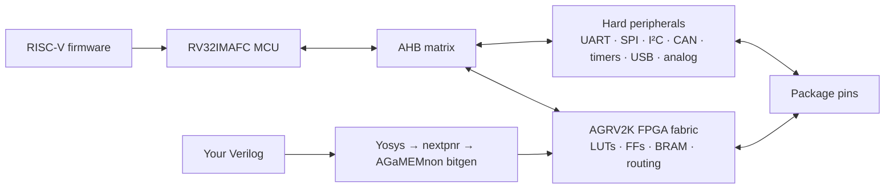

# Introduction to the AG32

The AGM AG32 is a RISC-V microcontroller and a small FPGA in one package. The
MCU runs ordinary firmware and owns hard peripherals; the programmable fabric
can implement independent logic, route peripheral signals, or appear as
memory-mapped hardware beside the CPU.

AGaMEMnon is still very much a work in progress. Some things work, many do not,
and a few campaign designs did not behave correctly even with the original
vendor backend. In the August 2026 campaign, 25 designs reached vendor/open
parity, 52 did not route in AGaMEMnon, and 13 AGaMEMnon images built cleanly but
failed on hardware. See [Status](STATUS.md) for the current list of working and
broken pieces and [hardware validation](HARDWARE_VALIDATION.md) for bench
results.

## Mental model



The fabric is a real FPGA, not a software-configurable GPIO matrix. It has
placement, routing, clocks and a bitstream, so it can implement state machines,
protocol glue, soft peripherals, custom memory-mapped registers and even small
soft CPUs.

## Names you will encounter

| Name | Meaning |
|---|---|
| AG32 | AGM's MCU + programmable-logic family |
| AG32VF303CCT6 | LQFP-48 part used for most development/testing |
| AGRV2K | FPGA architecture/device family name used by vendor files |
| AGRV2KL48 | LQFP-48 fabric/package target |
| AGaMEMnon | This open SDK, FPGA flow and programmer |

`L48`, `L64`, `L100` and `Q32` are package variants. Bond maps have been
recovered for all four. The shared fabric means pad-free, fabric-logic-only
strict builds are allowed across the family, but physical IO support is still
L48-only in the normal strict flow. Other packages need their own board testing
before their pads/OE/electrical behavior can be treated like L48.

## Reference hardware

Most hardware work uses the **AG32VF303CCT6 LQFP-48 development board** with
`AGRV2KL48` fabric:

- 256 KiB main flash;
- 128 KiB SRAM;
- 8 MHz HSE used in the tested PLL configurations;
- four MCU-visible board LEDs;
- a Pico-connected IO qualification harness;
- CMSIS-DAP, flash-resident USB CDC and UART ROM programming paths.

See [Known-good hardware](KNOWN_GOOD_HARDWARE.md) for the exact setup.

## What the open flow looks like

```text
Verilog
  -> Yosys technology mapping
  -> nextpnr AGRV2K pack/place/route
  -> AGaMEMnon bit generation
  -> SRAM image + compressed flash image
```

The MCU side provides startup code, linker scripts, register headers, an open
HAL in progress, project templates and RISC-V GCC builds.

Useful starting points:

| Intent | Start with |
|---|---|
| Learn the MCU | `agamemnon new hello --template mcu-blink` |
| Learn the fabric | `agamemnon new hello --template fpga-io` |
| Connect MCU firmware to custom logic | `agamemnon new hello --template mcu-fpga` |
| See peripheral examples | [Peripheral examples](PERIPHERAL_EXAMPLES.md) |
| Understand pin routing | [MCU pin routing](MCU_PIN_ROUTING.md) |
| Understand the FPGA backend | [Architecture](ARCHITECTURE.md) |

## MCU/fabric interface

The external AHB path works for several retained examples, including a 32-bit
constant endpoint, small state machines and one reviewed four-word register
bank. Wider/general register banks are still unfinished.

The tested bus clock follows MTIME one-for-one, but the absolute MCU/peripheral
clock tree is still being characterized. MTIME measured 14.08 MHz in one
SRAM-loaded setup where older docs had assumed 10 MHz. See
[MCU clocks](MCU_CLOCKS.md) and [MCU AHB](MCU_AHB_REGISTER_BANK.md).

## Programming paths

| Transport | Factory board | Works if flash is broken? |
|---|---|---|
| SWD/DAP | Yes, with AGaMEMnon OpenOCD | Yes |
| Flash-resident USB CDC | Install first | No |
| UART0 mask ROM via Pico | ROM exists in factory silicon; extra wiring needed | Yes in principle; current Pico/L48 target setup still needs its final bench run |

Install the SWD/DAP tool with:

```sh
agamemnon install-openocd
agamemnon doctor --probe-dap
```

For flash/recovery details, see [Programming](PROGRAMMING.md).

## Clocks

The current fabric PLL table contains 45 accepted `(SYSCLK,HSE)` pairs. On the
8 MHz reference board, 43 SYSCLK points from 4 to 248 MHz have been measured.
Two additional byte-exact profiles use 12 or 16 MHz HSE inputs and have not been
run on this board.

These are **fabric** clocks, not RISC-V CPU frequencies.

The broader clock-distribution problem is not solved yet: one far-region state
test (`VP-AGM-007`) built and simulated correctly but did not run correctly on
the chip.

## Hard peripherals and pins

Firmware configures the hard peripheral controller; the loaded FPGA image
usually provides the route from that controller to package pins.

So a UART driver does not imply a fixed UART pin map. Loading another fabric
image can change or remove a previously working peripheral route. I²C also needs
open-drain IO and external pull-ups.

See [MCU pin routing](MCU_PIN_ROUTING.md) for the current working routes.

## Vendor documentation

Useful primary sources:

- [AGM AG32 product site](https://www.ag32mcu.com/)
- [AG32 development tools](https://www.ag32mcu.com/dev-tools-category/dev_tools_fpga/)
- [AG32VF303CCT6 development board](https://www.ag32mcu.com/aum-product/products_board_ag32vf303cct6/)
- [AG32 MCU Reference Manual](https://www.agm-micro.com/upload/userfiles/files/AG32%20MCU%20Reference%20Manual%2820250515%E4%BF%AE%E8%AE%A2%E7%89%88%EF%BC%89.pdf)
- [AGRV2K data sheet](https://www.agm-micro.com/upload/userfiles/files/AGRV2K_Rev_3_0.pdf)

AGM's information is scattered across several sites/downloads and the FPGA
backend remains closed. AGaMEMnon is the open replacement being built here.

## Terms used in detailed pages

- **Build supported**: the open flow can build it.
- **Silicon-qualified**: that specific setup was tested on hardware.
- **Vendor-documented**: AGM documents it; AGaMEMnon may not implement it.
- **Implemented, unqualified**: code exists, but the target-side hardware path
  has not been tested.

Most reader-facing docs should prefer ordinary “works / tested / unfinished”
wording unless one of these distinctions matters.