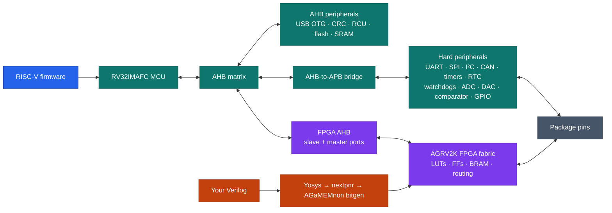

# Introduction to the AG32

The AGM AG32 is a RISC-V microcontroller and a small FPGA in one package. The
MCU runs ordinary firmware and owns hard peripherals; the programmable fabric
can implement independent logic, route peripheral signals, or appear as
memory-mapped hardware beside the CPU.

AGaMEMnon is still very much a work in progress. Some things work, many do not,
and a few campaign designs did not behave correctly even with the original
vendor backend. In the August 2026 campaign, 25 designs reached vendor/open
parity, 52 did not route in AGaMEMnon, and 13 AGaMEMnon images built cleanly but
failed on hardware. See [Status](STATUS.md) for the current list of working and
broken pieces and [hardware validation](HARDWARE_VALIDATION.md) for bench
results.

## Mental model



The fabric is a real FPGA, not a software-configurable GPIO matrix. It has
placement, routing, clocks and a bitstream, so it can implement state machines,
protocol glue, soft peripherals, custom memory-mapped registers and even small
soft CPUs.

## Names you will encounter

| Name | Meaning in this repository |
|---|---|
| AG32 | AGM's MCU-plus-programmable-logic product family |
| AG32VF303CCT6 | The LQFP-48 part used for most development and testing |
| AGRV2K | The programmable-logic architecture/device family name used by vendor files and AGaMEMnon |
| AGRV2KL48 | The LQFP-48 fabric target used for physical pin routing and current hardware testing |
| AGaMEMnon | The open SDK, FPGA flow, programmer and documentation in this repository |

`L48`, `L64`, `L100`, and `Q32` are package variants, QFN-32 to LQFP-100.
AGaMEMnon has recovered bond maps for all four. L48 is the package that has been
cross-checked and tested on hardware. The exact current behavior of pad-free
non-L48 image builds is inconsistent between existing docs and is tracked in
[Documentation issues](DOCUMENTATION_ISSUES.md); do not rely on it until that is
resolved.

## Current reference hardware

Most hardware work uses the **AG32VF303CCT6 LQFP-48 development board** with
`AGRV2KL48` fabric. The checked-in board definition records:

- 256 KiB main flash and 128 KiB SRAM;
- an 8 MHz HSE input used by the tested fabric PLL configurations;
- four MCU-visible board LEDs on the vendor-default `GPIO4[1:4]` routes;
- four tested fabric LED pads on package pins 25 through 28;
- DAP, flash-resident USB CDC, and mask-ROM UART transport information.

The official board page also describes a 50 MHz active FPGA oscillator, an
8 MHz MCU crystal, RTC clocking, buttons, LEDs, flash, USB, and expansion
headers.

See the machine-readable
[board definition](../agamemnon/sdk/boards/ag32vf303-l48.toml) and the
[hardware validation setup](HARDWARE_VALIDATION.md).

## What the open flow can do

AGaMEMnon's FPGA path is:

```text
Verilog
  -> Yosys technology mapping
  -> nextpnr AGRV2K pack/place/route
  -> AGaMEMnon bit generation
  -> volatile SRAM image or compressed flash image
```

The MCU side provides startup code, linker scripts, register headers, an open
HAL in progress, project templates, and RISC-V GCC builds. A project can contain
MCU sources and multiple Verilog sources with an explicit top module, PCF,
clocks, linker, board, outputs, and flash layout.

Useful starting points:

| Intent | Start with |
|---|---|
| Learn the MCU | `agamemnon new hello --template mcu-blink` |
| Learn the fabric | `agamemnon new hello --template fpga-io` |
| Connect MCU firmware to custom logic | `agamemnon new hello --template mcu-fpga` |
| Build the tested constant AHB endpoint | `examples/designs/mcu_ahb_constant_slave.v` |
| Route or create serial logic | `agamemnon new hello --template uart` or `examples/serial_mux/` |
| See tested peripheral examples | [Peripheral examples](PERIPHERAL_EXAMPLES.md) |
| Route MCU peripherals to pins | [MCU pin routing](MCU_PIN_ROUTING.md) |
| Understand the recovered FPGA | [Architecture](ARCHITECTURE.md) |

The MCU/fabric AHB path works for several specific examples: a 32-bit constant
endpoint, two address inputs, four directly placed registers, a counter, an
LFSR, and one reviewed register-bank composition with ID, scratch, counter and
W1C fields. Wider and more general register banks are still unfinished. The
bus clock tracks MTIME one-for-one in the tested setup, but its absolute source
and rate are still being investigated after MTIME measured 14.08 MHz rather
than the previously assumed 10 MHz. See [MCU clocks](MCU_CLOCKS.md) and
[MCU External AHB](MCU_AHB_REGISTER_BANK.md) for the details.

## Boot and programming paths

| Transport | Works on untouched board | Recovery when main flash is bad | Extra hardware |
|---|---|---|---|
| SWD/DAP | Yes, with AGaMEMnon's OpenOCD build | Yes | CMSIS-DAP probe |
| Flash-resident USB CDC uploader | No; install it first | No | USB cable only after installation |
| UART0 mask ROM through Pico | The ROM supports it; current Pico/L48 bench wiring is still being finished | ROM mechanism: yes | Pico 2 and the documented five-wire board addition |

The AG32 USB connector does not imply a factory USB bootloader. AGaMEMnon's USB
transport is an application installed in main flash. The flash-independent ROM
path found so far is UART0 with `BOOT0=1` and `BOOT1=0`. A Raspberry Pi Pico 2
bridge for it is checked in, but the current five-wire target-side bench setup
still needs its final hardware qualification run. See the
[AG32 UART programmer](../pico/ag32_uart_programmer/README.md).

Install and verify the SWD/DAP tool with:

```sh
agamemnon install-openocd
agamemnon doctor --probe-dap
```

Read [Programming](PROGRAMMING.md), [USB CDC uploader](USB_CDC_UPLOADER.md), and
[UART bootloader](UART_BOOTLOADER.md) before changing flash.

## Clocks and programmable IO

The current clock table contains 45 accepted fabric `(SYSCLK,HSE)` pairs. On
the 8 MHz reference board, 43 SYSCLK points from 4 to 248 MHz have been measured
on silicon. Two additional byte-exact profiles use 12 or 16 MHz HSE inputs and
have not been exercised on this board. See [MCU clocks](MCU_CLOCKS.md) and the
clock evidence files for the individual points.

These are fabric clocks, not RISC-V core frequencies.

Hard-peripheral signals do not automatically appear on arbitrary pins.
Firmware configures the peripheral controller and the fabric supplies the route
to package pins. I²C also needs open-drain behavior and external pull-ups. If a
new fabric image changes those routes, the vendor-default UART/SPI/I²C/LED pin
mapping may disappear with it.

## Documentation map

Vendor information is fragmented across AGM domains, Chinese-language pages,
downloadable archives, and several naming conventions. Useful primary sources:

- [AGM AG32 product site](https://www.ag32mcu.com/)
- [AG32 development tools](https://www.ag32mcu.com/dev-tools-category/dev_tools_fpga/)
- [AG32VF303CCT6 development board](https://www.ag32mcu.com/aum-product/products_board_ag32vf303cct6/)
- [AG32 MCU Reference Manual, 2025-05-15 revision](https://www.agm-micro.com/upload/userfiles/files/AG32%20MCU%20Reference%20Manual%2820250515%E4%BF%AE%E8%AE%A2%E7%89%88%EF%BC%89.pdf)
- [AGRV2K data sheet, revision 3.0](https://www.agm-micro.com/upload/userfiles/files/AGRV2K_Rev_3_0.pdf)
- the separate `AG32-Docs` research workbench, which is not currently public;
  derived artifacts are cited by repository path when they are not
  redistributed here

AGM currently lists AG32 SDK and Supra downloads for Windows and Linux. The
programmable-logic format and backend are still closed; AGaMEMnon is the open,
inspectable alternative being built here.

## Terms used in the detailed docs

- **Build supported**: the open flow builds it.
- **Silicon-qualified**: that specific setup was tested on hardware.
- **Vendor-documented**: AGM documents the feature; AGaMEMnon may or may not
  support it yet.
- **Implemented, unqualified**: code exists and has software tests, but the
  target-side hardware path has not been tested yet.

The detailed pages use these distinctions where they matter; this overview
mostly sticks to "works", "tested", and "unfinished".
